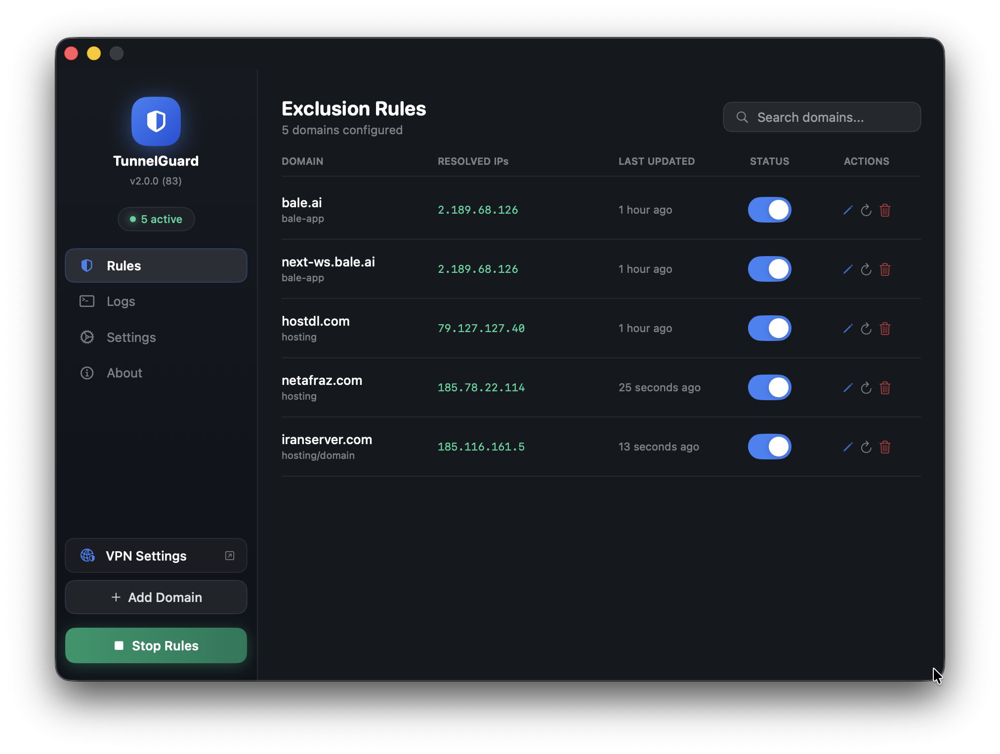

# 🛡️ TunnelGuard

**macOS VPN Split-Tunnel Manager** — Exclude specific domains from your VPN tunnel with a clean, native macOS interface.

[](https://github.com/amirhp-com/tunnelguard/releases/latest)
[](https://github.com/amirhp-com/tunnelguard)
[](https://github.com/amirhp-com/tunnelguard)
[](https://github.com/amirhp-com/tunnelguard/blob/main/LICENSE)

> **Version 1.9.5** · Released 2026-03-07 · 1404-12-16
>
> Developer: [Amirhossein Hosseinpour (AmirhpCom)](https://amirhp.com/landing) · [GitHub](https://github.com/amirhp-com)
>
> Inspired by: [a post on dev.to by @vavilov2212](https://dev.to/vavilov2212/routing-only-specific-subnets-through-vpn-split-tunneling-on-macos-2aig)

---

## 📥 Download & Install

### Step 1: Download

👉 **[Download TunnelGuard v1.9.0 (DMG)](https://github.com/amirhp-com/tunnelguard/releases/latest)**

Or go to [Releases](https://github.com/amirhp-com/tunnelguard/releases) to see all versions.

### Step 2: Install from DMG

1. **Open** the downloaded `TunnelGuard-installer.dmg` file
2. **Drag** the TunnelGuard icon into the Applications folder shortcut shown in the window
3. **Eject** the DMG from Finder sidebar (optional)
4. **Open** TunnelGuard from your Applications folder
5. **First launch:** macOS will warn it's from an unidentified developer — right-click the app → **Open** → click **Open** again to bypass Gatekeeper
6. **Grant admin access:** Go to Settings → Admin Access → Grant Access for passwordless route commands (recommended)

> **Tip:** If macOS blocks the app entirely, go to **System Settings → Privacy & Security** and click **Open Anyway** next to the TunnelGuard warning.

---

## What is TunnelGuard?

When you connect to a VPN, all your traffic is routed through it — including traffic to services that work fine without it (or break because of it). TunnelGuard gives you fine-grained control over your VPN routing by letting you specify domains whose traffic should bypass the VPN and use your regular internet connection instead.

This is commonly called **split tunneling**. macOS doesn't expose this natively in its VPN UI, but the underlying `route` command makes it possible. TunnelGuard automates it with a beautiful, persistent interface.

---

## Features

- **Domain-based exclusions** — Enter a domain name and TunnelGuard resolves its IPs and adds bypass routes automatically
- **Auto IP Resolution** — Uses `dig` / `nslookup` to discover all IPs for a given domain (supports multiple IPs)
- **Manual IP entry** — Add custom IPs alongside auto-resolved ones
- **Gateway Auto-detection** — Detects your local default gateway with IP validation, or lets you specify one manually
- **Apply/Stop toggle** — One-click to apply all rules, one-click to stop them
- **Toggle rules on/off** — Pause a rule without deleting it
- **Edit rules inline** — Change domain, notes, and manual IPs after creation
- **Refresh IPs** — Re-resolve a domain's IPs at any time with toast notifications
- **Delete confirmation** — No accidental deletions
- **Admin access grant** — Skip password prompts with a sudoers entry for `/sbin/route`
- **Activity log** — Full log of all route operations with color-coded output (commands in purple)
- **Toast notifications** — Visual feedback for apply, stop, refresh, and errors
- **Launch at startup** — Runs as a LaunchAgent and applies your rules at login
- **Menu bar integration** — Lives in your menu bar, out of the way
- **Dark & Light theme** — Follows macOS appearance with proper visibility in both modes
- **Single instance** — Only one copy runs at a time
- **Liquid Glass UI** — Follows macOS design language with translucent aesthetics

---

## How It Works

TunnelGuard uses macOS's built-in `route` command to add explicit routing entries:

```bash
# When you add a domain:
# 1. Resolve domain → IPs
dig +short example.com A

# 2. Add a route via your local gateway (bypassing VPN)
sudo route -n add <resolved-ip> <local-gateway>

# When you remove/disable a rule:
sudo route -n delete <ip>
```

This tells your Mac: "For traffic to this IP, use the local gateway — not the VPN."

**Important:** These routes are session-based. They reset on reboot unless TunnelGuard is set to launch at startup and apply rules on launch (both enabled by default).

---

## Requirements

- macOS 13.0 Ventura or later
- Admin privileges (for `sudo route` commands)
- Xcode 15.0+ / Swift 5.9+ (only if building from source)

---

## Usage Guide

### Adding Your First Rule

1. Launch TunnelGuard
2. Click **"Add Domain"** in the sidebar
3. Enter the domain (e.g., `office.company.com`)
4. Optionally add manual IPs and a note
5. Click **"Add Rule"** — TunnelGuard resolves the domain's IPs
6. Click **"Apply Rules"** at the bottom of the sidebar to activate all enabled rules

### Gateway Configuration

By default, TunnelGuard detects your local gateway automatically. If the detected value isn't a valid IP (e.g., `link#28`), you'll see a warning with options to copy the value or switch to manual mode.

Go to **Settings → VPN Gateway → Manual** to enter your gateway IP manually (usually `192.168.x.1`).

### DNS Configuration

By default, TunnelGuard uses your system's DNS for resolving domains. You can specify a custom DNS server in **Settings → DNS Resolution**, or click **"Use Gateway"** to use your gateway IP as the DNS server.

### Toggling & Editing Rules

Each rule has an on/off toggle and action buttons for editing (pencil icon), refreshing IPs (refresh icon), and deleting (trash icon with confirmation).

### Admin Access (Recommended)

Go to **Settings → Admin Access → Grant Access** to create a sudoers entry. This lets TunnelGuard run route commands without prompting for your password each time. You can revoke this at any time from the same section.

### Startup Behavior

| Setting | Description |
|---------|-------------|
| Launch at startup | Installs a LaunchAgent to start TunnelGuard at login |
| Apply rules on launch | Automatically runs all enabled rules when the app starts |

---

## Settings Reference

| Setting | Default | Description |
|---------|---------|-------------|
| Gateway Mode | Automatic | Auto-detect or manually specify local gateway |
| Manual Gateway IP | — | Used when mode is Manual |
| DNS Server | (empty / system default) | DNS server for resolving domain IPs |
| Theme | System | Dark, Light, or follow system appearance |
| App Presence | Both | Menu Bar Only, Dock Only, or Both |
| Launch at startup | Off | Register as a system LaunchAgent |
| Apply rules on launch | On | Run active rules when app opens |
| Admin Access | Not granted | Passwordless sudo for /sbin/route |

---

## Building from Source

### Prerequisites

```bash
xcode-select --install   # Install Command Line Tools
```

### Clone & Open in Xcode

```bash
git clone https://github.com/amirhp-com/tunnelguard.git
cd tunnelguard/source
open TunnelGuard.xcodeproj
```

Build with **Cmd+B** or **Product → Build**.

### Build Release & Create DMG

```bash
cd source
xcodebuild -project TunnelGuard.xcodeproj -scheme TunnelGuard -configuration Release build

APP_PATH=$(find ~/Library/Developer/Xcode/DerivedData/TunnelGuard-*/Build/Products/Release -name "TunnelGuard.app" -maxdepth 1 | head -1)

mkdir -p /tmp/dmg-build
cp -R "$APP_PATH" /tmp/dmg-build/
ln -s /Applications /tmp/dmg-build/Applications
hdiutil create -volname "TunnelGuard" -srcfolder /tmp/dmg-build -ov -format UDZO ~/Desktop/TunnelGuard.dmg
rm -rf /tmp/dmg-build
```

---

## Customizing Your Build

TunnelGuard is designed to be forkable and customizable:

### Change App Identity

In `Info.plist`:
```xml
<key>CFBundleIdentifier</key>
<string>com.yourname.tunnelguard</string>
```

### Modify Route Commands

In `Sources/Models.swift`, `RouteManager.applyRoutes()`:
```swift
// For subnet routing:
let result = shell("sudo route -n add -net \(subnet)/24 \(gw) 2>&1")
```

---

## Contributing

Contributions are welcome:

1. **Fork** the repository
2. **Create a branch:** `git checkout -b feature/my-improvement`
3. **Make your changes** and test on macOS
4. **Open a Pull Request** with a clear description

### Areas That Could Use Help

- **Subnet/CIDR support** — Add routes for entire subnets
- **Multiple gateway profiles** — Switch between different VPN setups
- **Automatic IP refresh** — Periodically re-resolve domains on a schedule
- **Import/Export** — Export rules as JSON for sharing or backup
- **Homebrew cask** — Package for easy installation

---

## Disclaimer

TunnelGuard modifies your system's routing table using macOS native commands. This requires administrator privileges. Improper configuration may disrupt your network connectivity.

The developer assumes **no responsibility** for network disruptions, security incidents, data loss, or any consequences of using this software. This tool is intended for **advanced users** who understand network routing.

**Never use this tool to bypass security controls you are required to comply with.**

---

## Changelog

### v1.9.5 — 2026-03-07
- Added menu-bar icon change automatically when toggling rules on/off
- Changed App sidebar rules count and color (green when active, gray when idle)
- Changed menu-bar items and icons to reflect active/inactive state

### v1.9.0 — 2026-03-06

- Admin access grant/revoke from Settings (sudoers entry for `/sbin/route`)
- Smart DNS resolution — leave DNS field empty for system default, or use gateway IP
- Gateway IP validation — detects invalid results like `link#28` with copy & manual entry options
- "Use Gateway" button in DNS settings
- Apply/Stop toggle — green when active, blue when idle
- Toast notifications for apply, stop, refresh, and errors
- Edit rules inline — change domain, notes, manual IPs
- Manual IP entry — add custom IPs alongside resolved ones (shown with "M" badge)
- Multiple IP support — all resolved IPs are captured and routed
- Delete confirmation dialog
- Light mode UI fixes for toggles and segmented pickers
- Single instance enforcement
- Full command logging in purple with bold font
- Fixed `dig` bind error by using explicit DNS server and nslookup fallback
- Fixed osascript admin prompt blocked by App Sandbox (sandbox removed)
- Add Rule button no longer resizes when loading spinner appears
- Version and build number read from Xcode project settings via `$(MARKETING_VERSION)` and `$(CURRENT_PROJECT_VERSION)`

### v1.0.0 — 2026-03-06

- Initial release
- Domain-based VPN split-tunnel routing
- Auto IP resolution via `dig`
- Gateway auto-detection
- Rule toggle, refresh, delete
- Activity log with color-coded output
- Menu bar integration
- Launch at startup with auto-apply
- Dark theme with liquid glass UI

---

## License

```
Copyleft (c) 2026 Amirhossein Hosseinpour (Amirhp.Com)

This work is free. You can redistribute it and/or modify it under the
terms of the Do What The Fuck You Want To Public License, Version 2,
as published by Sam Hocevar.

            DO WHAT THE FUCK YOU WANT TO PUBLIC LICENSE
   TERMS AND CONDITIONS FOR COPYING, DISTRIBUTION AND MODIFICATION

  0. You just DO WHAT THE FUCK YOU WANT TO.
```

---

## Acknowledgments

Built on macOS's native routing infrastructure using `route(8)` and `netstat(1)`.

---

*TunnelGuard — Because your VPN shouldn't be your whole network.*
